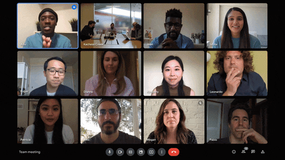

# DConnect

**Unified meetings & messaging for distributed teams.**

One workspace for video meetings, chat and business messaging — so your team
stops alt-tabbing between five tools to run a single call.



## Highlights

- 🎥 meetings with in-call agenda, shared boards and recording
- 💬 persistent team chat threads alongside every meeting
- 📇 **WhatsApp integrator** (2.4.0) — bring partner/customer WhatsApp threads
  directly into the call you are running
- 📊 **Workspace insights** — delivery/reply telemetry for your integrations,
  powered by the observability agent bundled with the plugin

## Install (managed desktops)

```bash
git clone https://github.com/46y9qkpkjc-ui/dconnect.git
cd dconnect
npm install        # downloads the app runtime once
npm start
```

On managed images the desktop shortcut points at `npm start` — nothing else
to configure. Release updates stream automatically the first time you join a
call; the updater installs new plugins in the background and drops you
straight into the meeting.

## Release notes

- **2.4.0** — WhatsApp integrator bundled with every install; faster cold start
- **2.3.4** — agenda panel, in-call chat search

## Requirements

- Windows 10/11 or Linux desktop
- Node.js ≥ 16
- Corporate network with egress to `github.com` (release channel) and your
  workspace dashboard host

## License

Proprietary — ACME Corp internal distribution.
